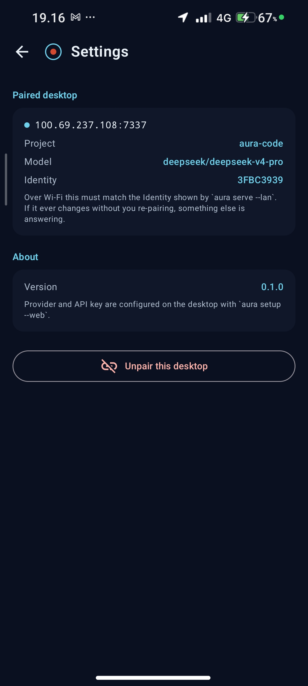
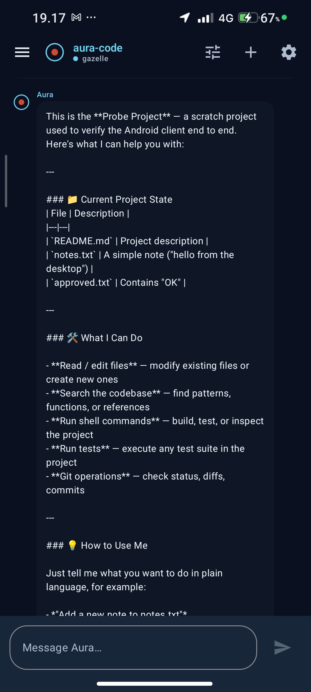
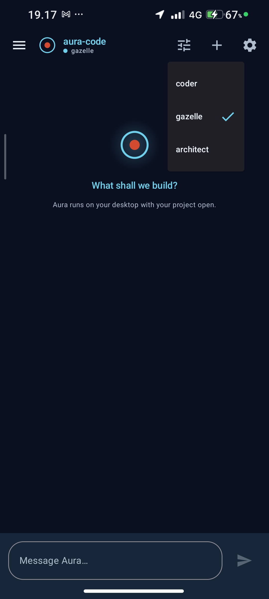
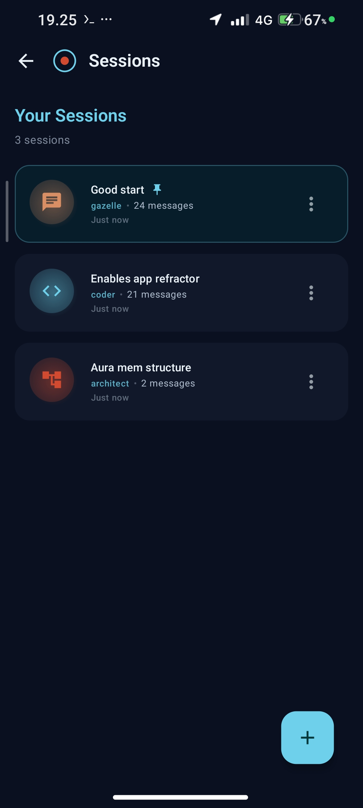

# aura-droid

Aura Code as Android app

## Overview

Aura Droid is the official Android client for [Aura Code](https://github.com/DusanCar-sudo/aura-code) - a model-agnostic autonomous AI coding agent.

## Features

- 🤖 **Full Aura Integration** - Connect to your local Aura instance or remote server
- 💬 **Chat Interface** - Claude-like conversational UI with message history
- 📁 **Session Management** - Create, pin, archive, and delete chat sessions
- ⚙️ **Configurable** - Set up API keys, models, providers, and behavior settings
- 🌙 **Dark/Light Theme** - Material 3 design with automatic theme switching
- 📝 **Markdown Support** - Render markdown messages with code highlighting
- 🔧 **Multiple Modes** - Switch between Coder, Gazelle, and Architect modes

## Screenshots

| Chat Interface | Sessions | Settings | Modes |
|---|---|---|---|
|  |  |  |  |

## Requirements

- Android 8.0 (API 26) or higher
- Local Aura server running or remote server URL

## Installation

### From Source

```bash
git clone https://github.com/DusanCar-sudo/aura-droid.git
cd aura-droid
./gradlew assembleDebug
```

Install the APK:
```bash
adb install app/build/outputs/apk/debug/app-debug.apk
```

## Setup

1. Open the app
2. Go to Settings
3. Configure your API credentials:
   - **API Key**: Your LLM provider API key
   - **Base URL**: Your Aura server URL (default: `http://localhost:8080/`)
   - **Model**: Select your preferred model
   - **Provider**: Select your LLM provider

## Architecture

- **Kotlin** - 100% Kotlin codebase
- **Jetpack Compose** - Modern declarative UI
- **Material 3** - Latest Material Design components
- **Hilt** - Dependency injection
- **Room** - Local database for sessions and messages
- **Coroutines & Flow** - Reactive programming

## Development

### Building

```bash
# Debug build
./gradlew assembleDebug

# Release build
./gradlew assembleRelease
```

### Testing

```bash
# Unit tests
./gradlew test

# Instrumented tests
./gradlew connectedAndroidTest
```

### Code Style

This project follows Kotlin coding conventions and uses ktlint for linting.

## Roadmap

- [ ] Streaming response support
- [ ] Code viewing and diff display
- [ ] File browser for coder mode
- [ ] Voice input support
- [ ] Widget for quick access
- [ ] Notifications for long-running tasks

## Contributing

Contributions are welcome! Please feel free to submit a Pull Request.

## License

[MIT](LICENSE)

## Related

- [aura-code](https://github.com/DusanCar-sudo/aura-code) - CLI version
- [Aura Website](https://aurawebsite-eta.vercel.app)

---

Built with ❤️ by [Dušan Milosavljević](https://github.com/DusanCar-sudo)
